# 法考备考 Skill · Legal Exam Prep

> 帮助法学院学生通过**国家统一法律职业资格考试（法考 / China Bar Exam）**的 OpenClaw Skill。
> 让考生**可查可练**，内容**权威、可溯源**。覆盖客观题 + 主观题两阶段、全 18 科目。
> 因 2018 年起司法部不再公布真题，本 Skill 以"官方法条 + 大纲 + 趋势模拟题"填补练题缺口。

[English README →](./README_EN.md)

---

## 一、为什么需要这个 Skill

法考被称为"天下第一考"，其真实难点在于：

| 难点 | 说明 | 本 Skill 的应对 |
|------|------|----------------|
| **两阶段考试** | 客观题（300分，合格成绩 2 年内有效）→ 主观题（180分：案例分析/法律文书/论述） | 两阶段全覆盖，分别设计训练路径 |
| **18 个科目** | 卷一 9 科 + 卷二 9 科，分值权重差异大 | 全科目考点库，可按卷/科/系统检索 |
| **真题不公开** | 2018 年起司法部不再公布真题与标准答案，仅有"回忆版"（未经官方确认） | 趋势驱动模拟题 + 2018 前真题/回忆版，明确标注来源性质 |
| **法律年年修订** | 2024 新《公司法》、2023《刑法修正案（十二）》、新《行政复议法》等 | 新法优先，每个考点标注最新生效版本 |
| **权威要求高** | 错一条法条就是错一片考点 | 分级溯源（L1–L5），每条必引依据 |

本 Skill 以"**可查可练**"为核心，帮助考生在**无官方真题**的现实下，依然能**体系化复习、精准练习、权威溯源**。

---

## 二、四大核心功能（详解）

### 模块 1 · 考点速查（Knowledge Lookup）
按 **科目 / 学科 / 考点 / 法条** 任意维度检索，返回"考点速查卡"：
- 核心要件（速记）+ 法律效果
- 法条依据（标注 L1–L4 层级与具体条款）
- 易混淆点 + 记忆口诀
- 关联真题 / 模拟题链接

**触发示例**：
> "查一下善意取得的构成要件"
> "刑法第 20 条正当防卫的成立条件与限度"
> "列出宪法修改程序的要点"

### 模块 2 · 客观题专项练习（Objective Practice）
生成 / 调用 单选、多选、不定项题目，每题含：
- 题干 + 答案 + 逐选项解析
- 考点映射（对应哪一条法条）
- 易错分析（命题陷阱识别）
- 答题技巧提示

**触发示例**：
> "出一道新《公司法》相关的客观单选题，带解析"
> "来 10 道刑法未遂/中止的易错多选题"

### 模块 3 · 主观题案例分析训练（Subjective Training）
针对主观题三大题型训练答题方法：
- **案例分析**："结论 + 法条依据 + 案情分析 + 结论重申"四段式，附采分点
- **法律文书**：起诉状/答辩状/代理词/判决书格式框架
- **论述题**：习近平法治思想 / 法理的"总—分—总"结构

**触发示例**：
> "写一道民法合同纠纷的主观题案例分析示范"
> "给我一份民事起诉状的标准格式与写作要点"

### 模块 4 · 趋势驱动模拟题（Mock Generation）
基于 **大纲 + 新法修订 + 命题趋势** 命制五类特色模拟题：
- 新法修订题（如认缴期限、董监高责任）
- 跨科目综合题（如刑民交叉）
- 命题陷阱题（易错识别）
- 热点案例题
- 认知层次递进题

> ⚠️ 所有模拟题**强制标注 `【模拟题 · 非真题】`**，绝不冒充官方真题。

---

## 三、权威性保障

每一处输出均标注来源，遵循分级溯源规范（详见 `references/authoritative-sources.md`）：

| 层级 | 来源 | 示例 |
|------|------|------|
| L1 | 法律（全国人大及其常委会制定） | 《民法典》《刑法》《公司法》（2024修订） |
| L2 | 司法解释与立法解释 | 最高法/最高检司法解释、《正当防卫指导意见》 |
| L3 | 行政法规与部门规章 | 国务院条例、部委规章 |
| L4 | 司法部《考试大纲》+ 法律出版社《辅导用书（九大本）》《客观题指导用书》《案例分析指导用书》 | 命题范围与重点 |
| L5 | 最高人民法院指导性案例、公报案例 | 主观题案例素材、裁判要旨 |
| L6 | 学术通说（仅作辅助，不作唯一依据） | 疑难问题补充视角 |

> **时效优先原则**：新法优于旧法、特别法优于一般法。涉及修订法律的考点，一律以最新生效版本为准，并注明施行日期。

### 诚信边界（重要）
- 2018 年（含）以后司法部不再公布真题与答案，仅有"回忆版"（未经官方确认）。
- 本 Skill 命制的题目**强制标注 `【模拟题 · 非真题】`**，**绝不冒充**官方真题或标准答案。
- 真题 / 回忆版 / 模拟题在输出中**明确区分来源性质**。
- 任何无法核实的内容，均标注 `【待核实】` 并提示以官方最新文件为准。

---

## 四、目录结构

```
legal-exam-prep/
├── SKILL.md                      # 技能主文件（触发词 + 四大模块 + 使用流程）
├── references/                   # 8 份参考文档
│   ├── exam-system-overview.md       # 法考制度总览（阶段/科目/分值/时间）
│   ├── exam-syllabus-subjects.md     # 18 科目大纲详解（卷一/卷二）
│   ├── objective-question-guide.md    # 客观题解题指南（单/多/不定项策略）
│   ├── subjective-question-guide.md   # 主观题解题指南（案例/文书/论述）
│   ├── high-frequency-points.md       # 高频考点速查（按科目）
│   ├── authoritative-sources.md       # 权威来源与溯源规范（L1–L6）
│   ├── study-plan-templates.md        # 备考计划模板（分阶段/分基础）
│   └── exam-tips-strategies.md        # 应试策略与技巧（时间管理/失分点）
├── templates/                    # 8 个生成模板
│   ├── objective-single-template.md       # 客观题-单选
│   ├── objective-multiple-template.md     # 客观题-多选/不定项
│   ├── subjective-case-template.md        # 主观题-案例分析
│   ├── subjective-document-template.md    # 主观题-法律文书
│   ├── subjective-essay-template.md       # 主观题-论述题
│   ├── knowledge-point-template.md        # 考点速查卡
│   ├── mock-question-template.md          # 趋势模拟题
│   └── mock-exam-template.md              # 模拟试卷（100题/5题卷）
├── examples/                     # 4 个完整示例
│   ├── sample-objective-question.md      # 客观题示例（善意取得）
│   ├── sample-subjective-case.md         # 主观题案例示例（新公司法）
│   ├── sample-knowledge-point.md         # 考点卡示例（宪法修改）
│   └── sample-mock-question.md           # 模拟题示例（认缴期限）
└── docs/images/                  # 12 张流程图（7 张架构图 + 5 张演示图）
    ├── system-overview-en.svg
    ├── exam-structure-en.svg
    ├── question-types-en.svg
    ├── knowledge-query-en.svg
    ├── practice-loop-en.svg
    ├── mock-generation-en.svg
    ├── study-workflow-en.svg
    ├── demo-knowledge-lookup.svg         # 演示① 考点速查
    ├── demo-objective-practice.svg       # 演示② 客观题练习
    ├── demo-subjective-training.svg      # 演示③ 主观题五步法
    ├── demo-mock-question.svg            # 演示④ 模拟题命制
    └── demo-end-to-end.svg               # 演示⑤ 一日备考流
```

---

## 五、流程图一览

### 架构图（系统如何组织）

**system-overview-en.svg** — 系统总览：四大模块 + 权威溯源底座

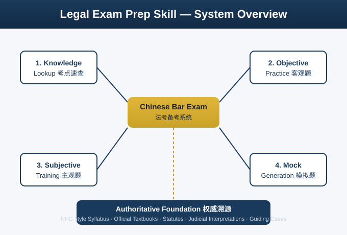

**exam-structure-en.svg** — 考试结构：客观题 → 主观题 两阶段

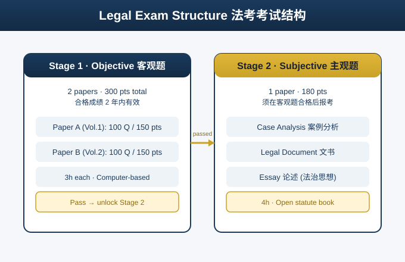

**question-types-en.svg** — 题型分布：客观题（单/多/不定项）+ 主观题（案例/文书/论述）

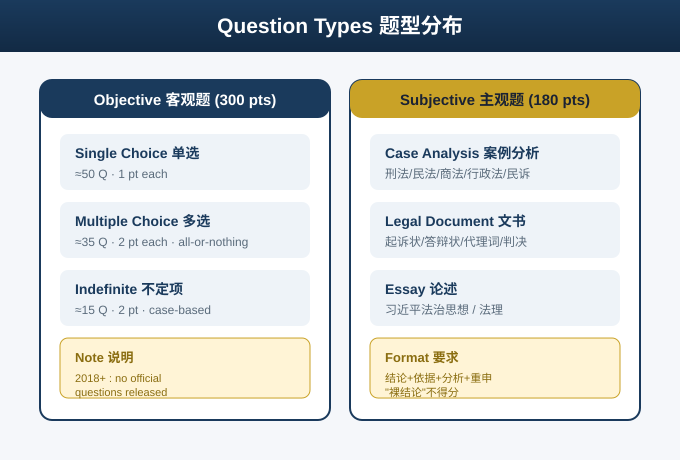

**knowledge-query-en.svg** — 考点速查流程

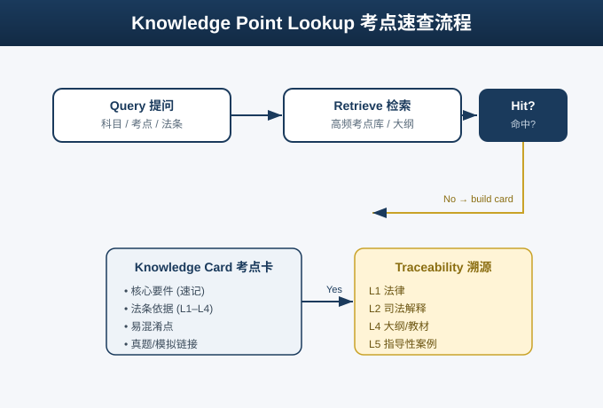

**practice-loop-en.svg** — 练题闭环：练 → 析 → 诊 → 固

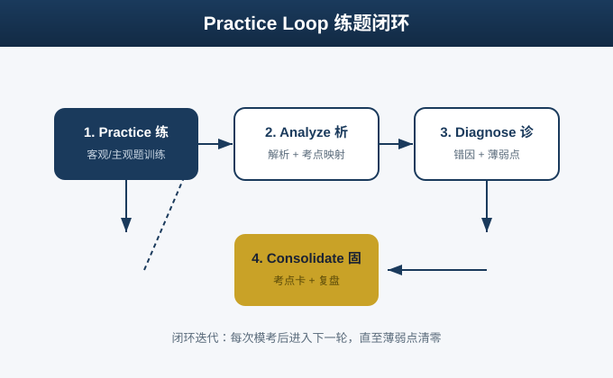

**mock-generation-en.svg** — 模拟题命制流程（明确非真题标注）

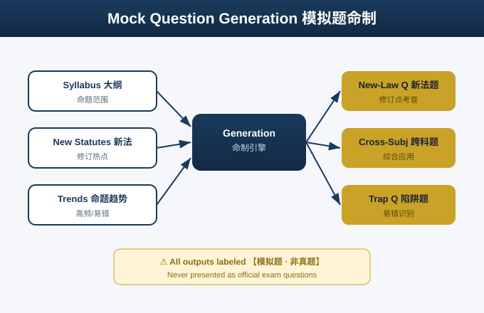

**study-workflow-en.svg** — 备考全流程：基础 → 强化 → 客观题 → 主观题 → 拿证

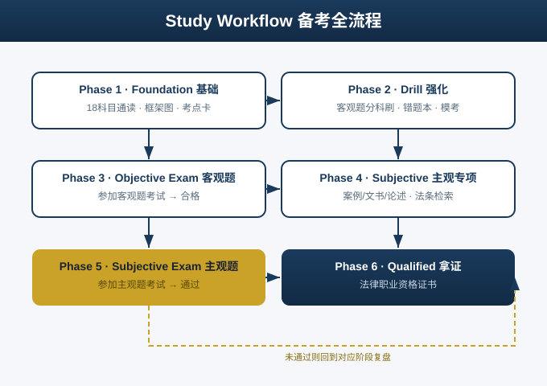

### 演示图（具体怎么用）

**demo-knowledge-lookup.svg** — 从"一个提问"到"一张可溯源考点卡"

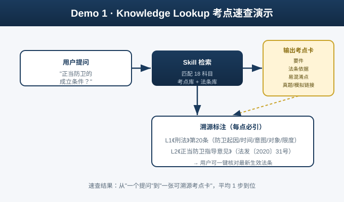

**demo-objective-practice.svg** — 客观题抽题 → 作答 → 解析 → 错题入本 → 复盘闭环

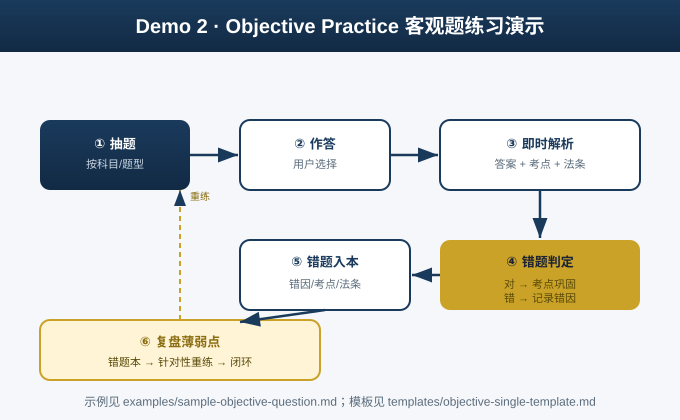

**demo-subjective-training.svg** — 主观题答题五步法（读题→定性→找法条→要件对应→写结论）

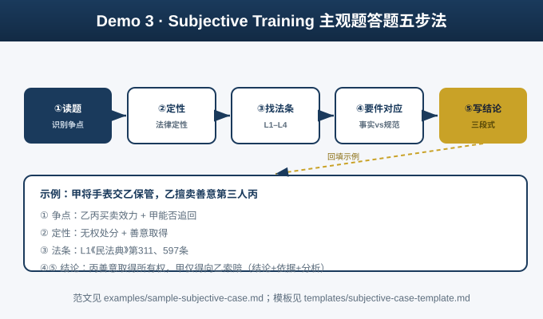

**demo-mock-question.svg** — 智能命制一道模拟题（选考点→定题型→织情境→标依据→校验）

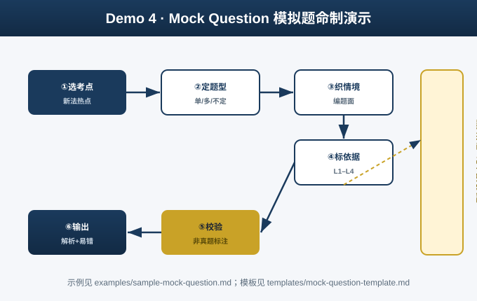

**demo-end-to-end.svg** — 考生一日备考流（四模块自然串联）

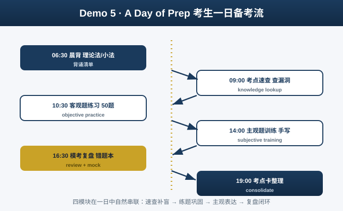

---

## 六、使用方式（快速上手）

1. **速查**：向 OpenClaw 提问"善意取得的构成要件"，获取考点卡 + 法条依据。
2. **练题**：请求"出一道新《公司法》相关的客观题，带解析"，获得模拟题。
3. **主观训练**：要求"写一道民法合同纠纷的主观题案例分析示范"，获得四段式范文。
4. **规划**：让 Skill 生成"零基础 12 个月备考计划"。
5. **模考**：请求"生成一套卷二客观模拟卷（100题）"，用于限时自测。

> 提示：所有输出均可要求"标注法条依据"或"用 2024 新法作答"，以触发权威溯源。

---

## 七、18 科目覆盖明细

**卷一（Vol.1，100题/150分）**：习近平法治思想、法理学、宪法、中国法律史、国际法、司法制度与法律职业道德、刑法、刑事诉讼法、行政法与行政诉讼法。

**卷二（Vol.2，100题/150分）**：民法、知识产权法、商法、经济法、环境资源法、劳动与社会保障法、国际私法、国际经济法、民事诉讼法（含仲裁制度）。

主观题从上述科目中选取，重点为刑法、民法、商法、行政法、民事诉讼法与刑事诉讼法，并含一道论述题（法治思想）。

---

## 八、常见问题（FAQ）

**Q1：这个 Skill 能提供官方真题吗？**
不能，也不声称拥有。2018 年起司法部不再公布真题；本 Skill 使用 2018 前真题、回忆版（标注来源）与自命模拟题（明确标注非真题）。

**Q2：模拟题和真题难度一致吗？**
模拟题依据大纲与命题趋势命制，旨在训练思维与查漏，不等于真题难度或命题方向。请以官方资料为准。

**Q3：法条会过期吗？**
会。本 Skill 遵循"新法优先"，但法律可能随时修订；最终请以全国人大/司法部最新公布文本为准。

**Q4：主观题能帮我写完整答案吗？**
能生成"答题示范"（含采分点），但建议考生先手写训练，再对照示范复盘，避免依赖。

---

## 九、重要声明

- 本 Skill 为**学习辅助工具**，所有内容基于公开大纲与法律文件生成。
- 本 Skill **不提供、不声称拥有**任何官方真题或标准答案。
- 模拟题仅供练习，与司法部真题无直接关联。
- 请以司法部官方公告与最新法律法规为最终依据。

---

## 十、License 与引用

本项目采用 MIT License。详见 [LICENSE](./LICENSE)。
如需引用，请参见 [CITATION.cff](./CITATION.cff)。
